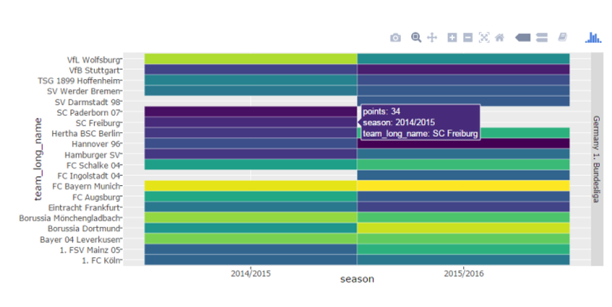

```{r setup, include=FALSE}
knitr::opts_chunk$set(echo = FALSE)
```

## Summary

This Application was built as part of the coursera course "Developing Data Procuts" as part of the Coursera Data Science Specialization. 

The app is developed as a shiny web app. A Demo is available at the shinyapps.io hosting site : https://fleschgordon.shinyapps.io/SockerTeamHeatmap/

Source code for ui.R and server.R files are available on the GitHub Repro here: https://github.com/fleschgordon/Coursera_DevDataProd

Web Presentation is here: http://rpubs.com/fleschgordon/233049

## Application

The data for the app comes from a famous socker data set from Hugo Mathien:
https://www.kaggle.com/hugomathien/soccer
<br>The database is a sqllite database.

The app was based on a sample from Uwe Strerr:
https://www.kaggle.com/nappon/d/hugomathien/soccer/the-fans-stay-loyal-the-players-move-on

The displayed heatmap is renderd via ggplot. The interactivity comes via plotly.

Its possible to filter via Season and League.

##heatmap code
```{r Heatmap_data, echo = TRUE, eval=FALSE}
con <- dbConnect(SQLite(), dbname="database.sqlite")
Match        <- tbl_df(dbGetQuery(con,"SELECT * FROM Match"))
Team        <- tbl_df(dbGetQuery(con,"SELECT * FROM Team"))
League        <- tbl_df(dbGetQuery(con,"SELECT * FROM League"))
dbDisconnect(con)
```
Team Points Heatmap via plotly and ggplot
```{r Heatmap_plot, echo = TRUE, eval=FALSE}
output$Heatmap <- renderPlotly({
 seasonsdata <- subset(tableLong, season %in% input$selSeason)
 seasonsdata$points <- as.factor(seasonsdata$points)
  
 p <- ggplot(filter(seasonsdata, league_name %in% input$selLeague), 
   mapping = aes(x = season, y = team_long_name)) 
 + geom_tile(mapping = aes(fill = points),color="white", size=0.1 ) 
 + facet_grid(league_name~., scales = "free_y") 
 + scale_fill_viridis(discrete=TRUE) + theme(legend.position = "none")  
 ggplotly(p)
 })
```
##Sample Plotly Heatmap Screenshot


